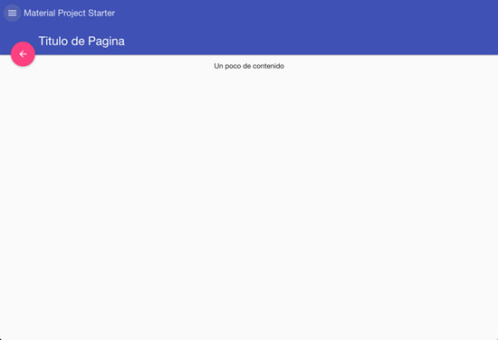
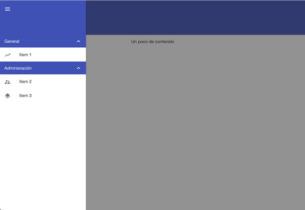

# Angular Material Starter Project - Web Application

- Web Application (Angular Material + Gale)

## Resources 

- [Source](https://github.com/dmunozgaete/angular-gale-starter-material)
- [Angular Gale Doc's](http://angular-gale.azurewebsites.net/)
- [Framework API](http://gale.azurewebsites.net/)

## Get Started

### Get dependencies

```sh
# bash
npm install					# restore npm packages
bower install				# restore bower libraries
```

### Mount development server

```sh
# bash
grunt lift			# Mount web server without [livereload]
```

### Update javascript & styles files 

```sh
# bash
grunt inject		# Update bower and bundles references
```

### Deploy to production

```sh
# bash
grunt deploy		# Minify,Uglify and package javascript & styles files
```

## Screenshot


